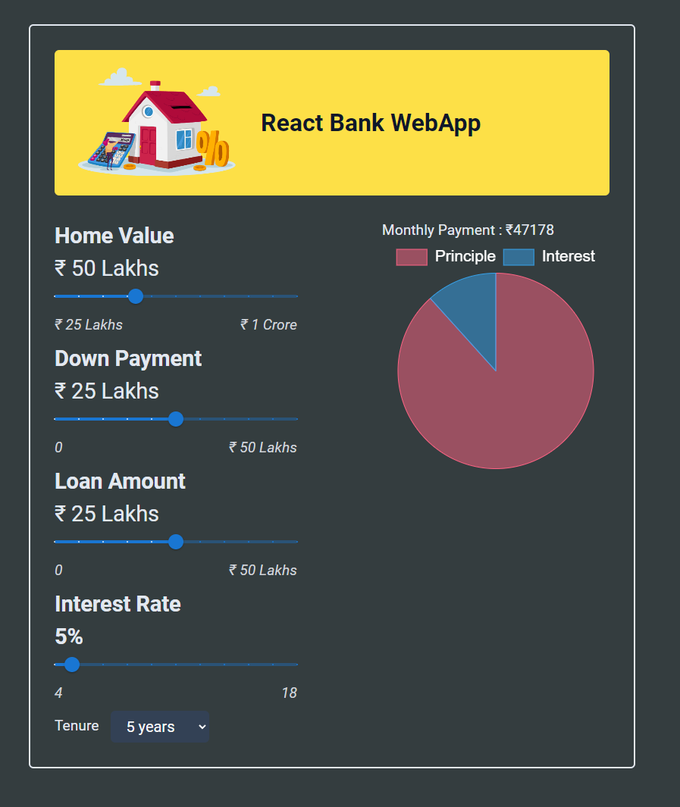

# Module#5 React Day #6 Classwork: React Bank WebApp


## Hosted Version of the Project:
[m5react-day-6-classwork-react-bank-webapp](https://m5react-day-6-classwork-react-bank-webapp.vercel.app/)

## Objectives
+ Developed a React Bank Dashboard that visualizes financial data using the Chart.js library.
+ Created an interactive dashboard that displays financial information in the form of a pie chart.
+ Implemented the 'lifting state up' concept to manage and pass data to the Chart.js component.
+ Used React's setState to update and render dynamic data in the dashboard.

## Formulas Used
+  totalLoan = loanTerm * 12
+  interest/Month = interestRate / 100 / 12
+  monthlyPayment = (loanAmount * interestPerMonth *(1 + interestPerMonth) ** totalLoanMonths) / ((1 + interestPerMonth) ** totalLoanMonths - 1)
+  totalInterestGenerated = monthlyPayment * totalLoanMonths - loanAmount

## How to install and run in yours local machine
```bash
npm install
npm run start
```

## Tech. Stack Used:
+ [React](https://react.dev/)
+ [TailwindCSS](https://tailwindcss.com/)
+ [Google Fonts](https://fonts.google.com/)
+ [Font Awesome](https://fontawesome.com/icons/)

## Author
[Abhishek kumar](https://www.linkedin.com/in/alex21c/), ([Geekster](https://geekster.in/) MERN Stack FS-14 Batch)


